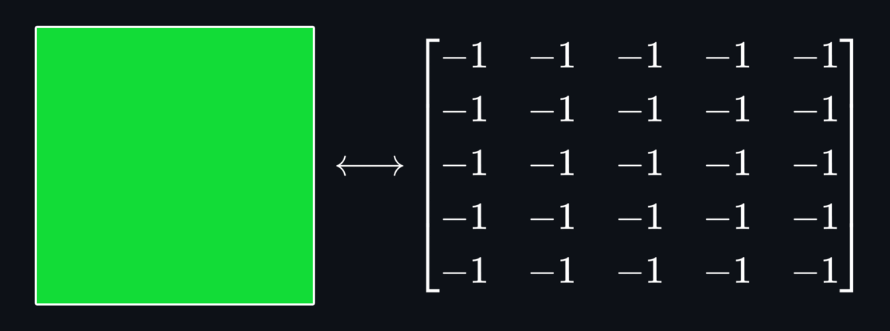
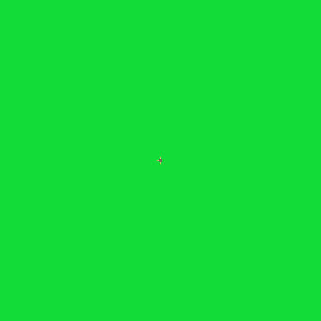

# WaveFunctionCollapse

Inspired by the original  and the  that explores it, the goal of this project is to produce a Python implementation of the algorithm.

In the Maxim Gumin's implementation, the tiles are given a _symmetry label_  to each tile in the tile set, that indicates the valid connections to each side. However, this project presents an alternative method to generate the adjacency rules using the individual colors of the tiles' edges.

#

  

